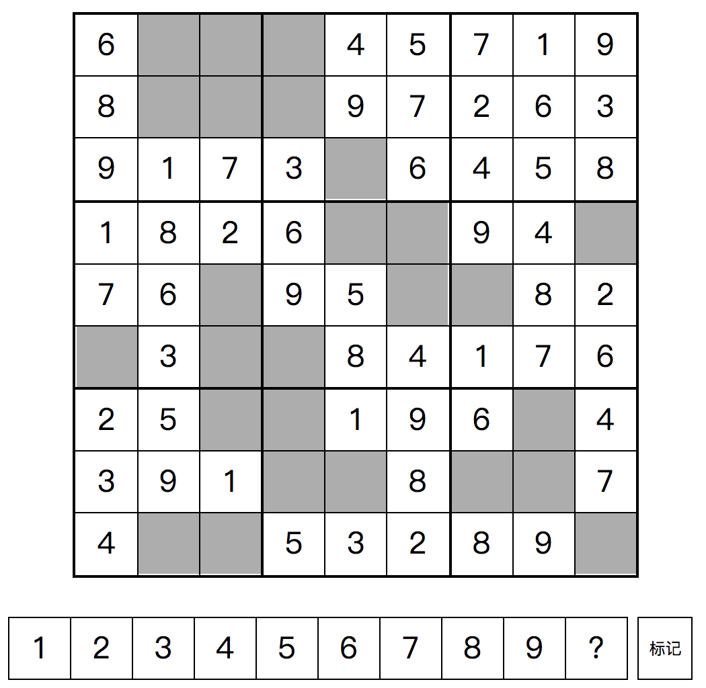
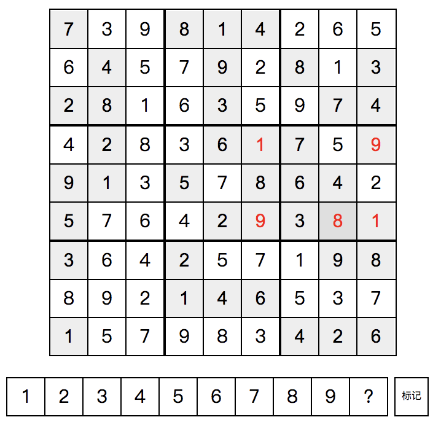
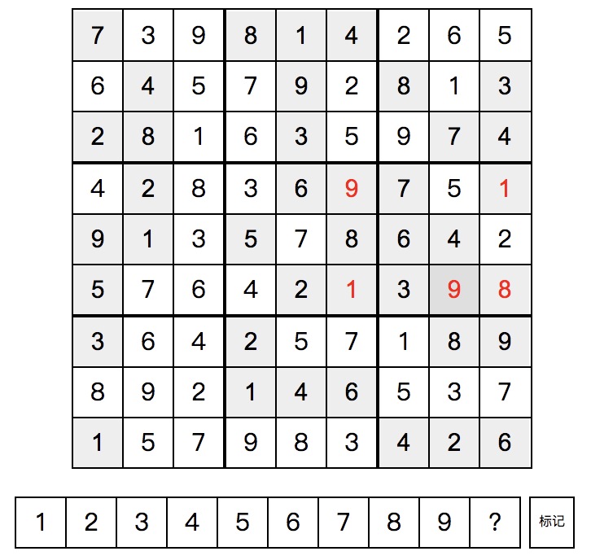

# Sudoku 数独游戏

可能会有多种答案

[体验地址](https://cl-window.github.io/shudu/)

网页版实现简单的数独小游戏

* 数独简介：数独是九宫格（即3格宽×3格高）的正方形状，每一格又细分为一个九宫格。在每一个小九宫格中，分别填上1至9的数字，让整个大九宫格每一列、每一行的数字都不重复。

* 本小游戏玩法：先点击数独界面上某个需要填数字的区域，再从下面的数字列表中选择合适的数字，如果有不确定的，可以暂时填入“？”。

* [代码思路参考](https://github.com/WqyJh/Sudoku)
* 源代码解释：简单来说就是一个9行9列的二维数组，再分为9个3x3的小方块，在里面随机填充0-9数字，只要满足每一行，每一列，以及9个小方块内，0-9只出现一次，即表示生成随机数独成功，然后根据难度大小，随机移除一些数字，移除的数字越多，难度越大；将剩下的数字按位置显示出来，即可开始一局游戏。
* 判断数字是否满足数独要求：对于0-9中某个数字 x, 检查该数字是否可放置在二维数组内 row 行 col 列 内；
    1. row 行没有该数字, 对row行9个数字遍历，查找是否有 x; 
    2. col 列没有该数字，对col列9个数字遍历，查找是否有 x;
    3. row 和 col 对应的3x3方块内没有该数字，方块开始位置startRow = Math.floor(row / 3) * 3;
    方块开始位置 startCol = Math.floor(col / 3) * 3;

* 随机生成数独数据：
    1. 先随机在9x9的填充数据，setBlockRandomly() 方法就是随机在一个3x3的方块内随机填充0-9；
    2. 随机填充数据后，从第一个位置开始，对上一步操作后，不完整的9x9的数组进行数据补充，边补充边判断是否满足数独要求，补充的数据是随机0-9中某一个， tryit()方法，通过递归的方式，对9x9的二维数组每一个位置进行填充和判断。

* 内存中存储了两个数组，一个是本次生成的数独数组，作为答案提供给用户；另一个是根据难度去掉一部分内容的数组，作为题目内容显示给用户。
* 用户先选中数独面板上某个空位，再从下放数字列表中选择合适的数字，填充进之前选择的空位，所以从数独面板选中空位后，内存中需要记录空位的信息，ClickItem 就是做这个操作的，记录在数组中的坐标以及界面上对应的显示控件。